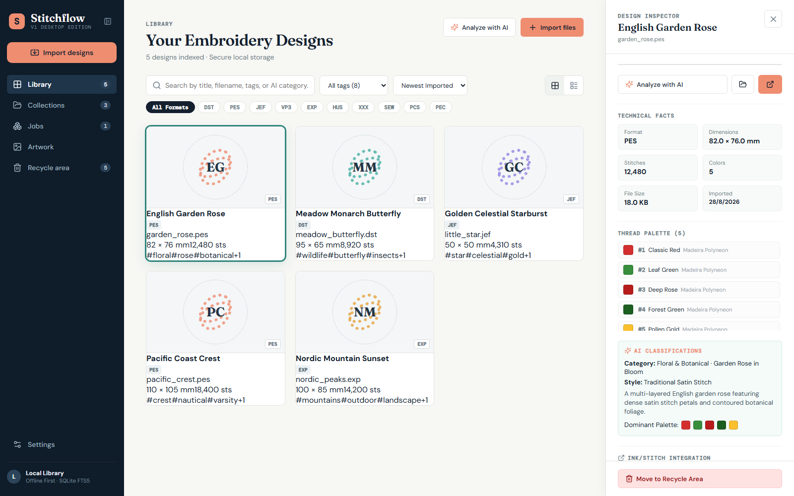
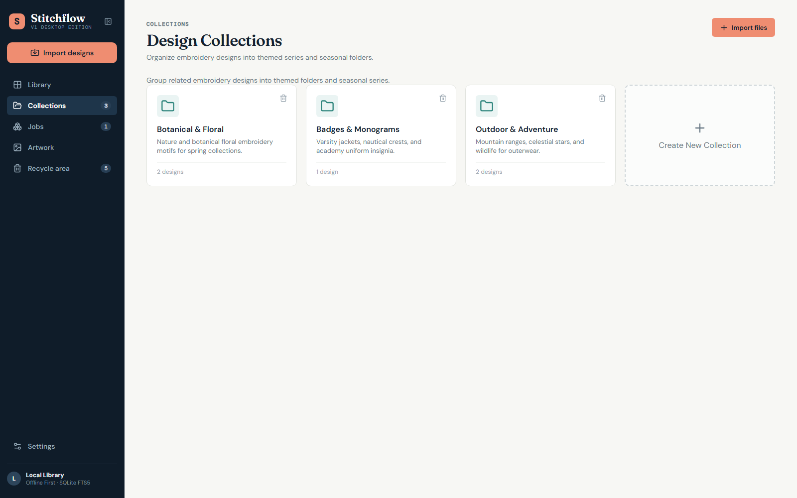
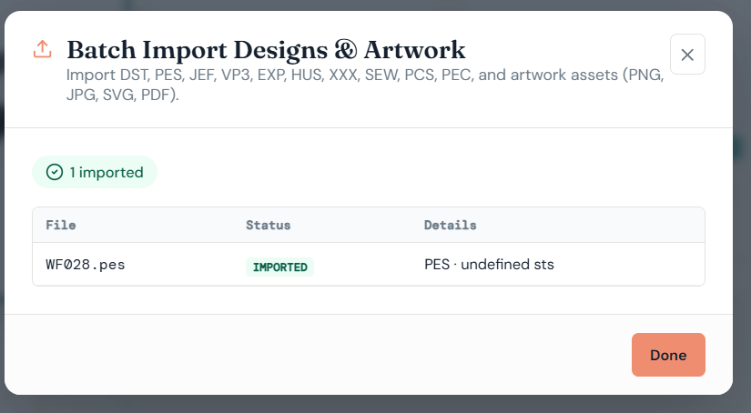

# Stitchflow — AI-Powered Embroidery Management Desktop Application

<p align="center">
  
</p>

**Stitchflow** is a modern, privacy-first, offline-first desktop application designed for professional digitizers, apparel decorators, and embroidery shops. It delivers a centralized hub for organizing, inspecting, searching, converting, and analyzing multi-format embroidery files and associated source artwork.

Built with **Tauri 2**, **React 18 + TypeScript**, **Rust**, **SQLite (with FTS5 Full-Text Search)**, and a **`pyembroidery` sidecar engine**.

---

## Key Features

- **Centralized Design Catalog**: Grid and table views with real-time vector & textured 2D stitch previews.
- **Deep Metadata Inspection**: Deterministic extraction of dimensions (mm), stitch counts, color stops, thread brand palettes, jump stitches, trims, and file sizes.
- **10 Major Format Engines**: Full inspection, rendering, and export support for `DST`, `PES`, `JEF`, `VP3`, `EXP`, `HUS`, `XXX`, `SEW`, `PCS`, and `PEC`.
- **Format Conversion & Export**: One-click cross-format conversion (e.g. `PES` → `DST`, `JEF`, `VP3`, `EXP`, `XXX`, `PEC`).
- **Vision-Capable AI Tagging**: Opt-in analysis using vision models to automatically classify categories, subjects, styles, and tags with a side-by-side review modal.
- **AI Vector Patch Generator & Auto-Digitizer**: Create stitch-ready patches and companion motifs using 6 curated physical embroidery presets (`3-Color Patch`, `Silhouette`, `Line Art`, `Varsity Crest`, `Folk Floral`, `Appliqué`) with automatic offline stitch calculation and direct library import.
- **Ink/Stitch Handoff**: One-click direct launch into Inkscape with the Ink/Stitch extension for stitch simulation, pull compensation tuning, and vector CAD editing.

- **Collections & Production Jobs**: Themed organizational series and lightweight job batch containers with garment notes and customer proof links.
- **Safe 2-Stage Quarantine**: Soft-delete quarantine area with one-click restoration or permanent disk purge.
- **Portable Backups**: Portable `.zip` backup generation with SHA-256 checksummed `manifest.json` and isolated validation/restore.

---

## Screenshots

<p align="center">
  <b>Catalog & Technical Inspector</b><br/>
  
</p>

<p align="center">
  <b>Thematic Collections Management</b><br/>
  
</p>

<p align="center">
  <b>Batch Importer & Deduplication</b><br/>
  
</p>

---

## Download & Installation

### Option 1: Download Release Binaries (Recommended)
Download the latest Windows Installer (`.msi`) or Standalone Executable (`.exe`) directly from:
👉 **[Stitchflow GitHub Releases](https://github.com/verciel/stitchflow/releases)**

### Option 2: Run from Source

#### Prerequisites
- **Node.js**: `v18+` or `v20+`
- **Rust Toolchain**: `stable` (via `rustup`)
- **Python**: `3.10+` or `3.11+` with virtual environment

#### Development Setup

```powershell
# 1. Clone the repository
git clone https://github.com/verciel/stitchflow.git
cd stitchflow

# 2. Set up Python virtual environment and dependencies
python -m venv .venv
.\.venv\Scripts\python.exe -m pip install --upgrade pip
.\.venv\Scripts\python.exe -m pip install -r src-tauri/embroidery-engine/requirements.txt

# 3. Install frontend dependencies
npm.cmd install

# 4. Launch desktop development app
npm.cmd run tauri dev

```

---

## Format Support Matrix

| Format | Native Machine / Brand | Metadata & Stitch Count | 2D Preview (PNG + SVG) | Format Export Conversion |
| :--- | :--- | :---: | :---: | :---: |
| **DST** | Tajima Industrial | ✅ Yes | ✅ Yes | ✅ Yes |
| **PES** | Brother / Babylock | ✅ Yes | ✅ Yes | ✅ Yes |
| **JEF** | Janome / Elna | ✅ Yes | ✅ Yes | ✅ Yes |
| **VP3** | Husqvarna Viking / Pfaff | ✅ Yes | ✅ Yes | ✅ Yes |
| **EXP** | Melco / Bernina | ✅ Yes | ✅ Yes | ✅ Yes |
| **XXX** | Singer / Compucon | ✅ Yes | ✅ Yes | ✅ Yes |
| **PEC** | Brother Deco | ✅ Yes | ✅ Yes | ✅ Yes |
| **HUS** | Husqvarna (Legacy) | ✅ Yes | ✅ Yes | Read-Only (Export to DST/PES) |
| **SEW** | Janome (Legacy) | ✅ Yes | ✅ Yes | Read-Only (Export to JEF/PES) |
| **PCS** | Pfaff (Legacy) | ✅ Yes | ✅ Yes | Read-Only (Export to VP3/PES) |

---

## Architecture Overview

```text
┌────────────────────────────────────────────────────────────┐
│                    React 18 + TypeScript                   │
│         (Vite, Lucide Icons, Modular UI Components)        │
└─────────────────────────────┬──────────────────────────────┘
                              │ Tauri 2 IPC Commands
┌─────────────────────────────▼──────────────────────────────┐
│                      Rust Core Runtime                     │
│  - AppState / Mutex SQLite Manager                         │
│  - FTS5 Query Engine & Triggers                            │
│  - Trait-Based EmbroideryFormatAdapter                     │
│  - Backup Engine (Zip Archive + SHA-256 Manifest)          │
│  - External Process Supervisor                             │
└───────────────┬────────────────────────────┬───────────────┘
                │ Subprocess IPC             │ Embedded Engine
┌───────────────▼──────────────┐   ┌─────────▼───────────────┐
│     Python Engine Sidecar    │   │      SQLite Database    │
│  - pyembroidery Parser       │   │  - 10 Relational Tables │
│  - Anti-aliased 2D Renderer  │   │  - FTS5 Full-Text Search│
│  - Cross-Format Converter    │   │  - Non-destructive Migr.│
└──────────────────────────────┘   └─────────────────────────┘
```

---

## Verification & Testing

Run the automated test suites:

```powershell
# Python Sidecar Engine Tests (5/5 passing)
.\.venv\Scripts\python.exe -m unittest tests/test_engine.py

# Rust Core Tests (2/2 passing)
cd src-tauri && cargo test --lib

# Frontend Unit Tests (3/3 passing)
npm.cmd test

# Production Build Check
npm.cmd run build

```

---

## Documentation & Guides

Comprehensive documentation is available in the [`docs/`](docs/) directory:

- 📊 **[Database Setup & Schema Guide](docs/DATABASE_SETUP.md)**: SQLite architecture, 10 relational tables, FTS5 full-text triggers, schema migrations, and backup verification.
- ⚙️ **[Installation & Configuration Guide](docs/INSTALLATION_GUIDE.md)**: Pre-built binaries, running from source, Python environment setup, Ink/Stitch configuration, and AI vision endpoints.
- 🛠️ **[Technical Architecture Documentation](docs/TECHNICAL_DOCUMENTATION.md)**: Multi-process IPC protocol, trait-based format adapters, vision extraction pipeline, and threading models.
- 📖 **[User Manual & Operations Guide](docs/USER_GUIDE.md)**: Step-by-step instructions for importing, searching, converting, organizing collections, production jobs, and AI tagging.

---

## License

MIT License. Designed and developed with Stitchflow.

